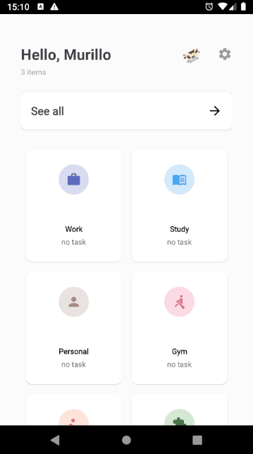

# MuTodo
A **muuuuuuuuuu** todo list

The **MuTodo** is a task manager application, created to practice Android develoment skills.
This project use Clean Architecture, MVVM, Koin for DI, Jetpack libs (Navigation, databinding, Room...) 

This application also trigger **alarms** and **notifications** according to the tasks registered, with a **muuuuuuuuuuuu** audio.

git 